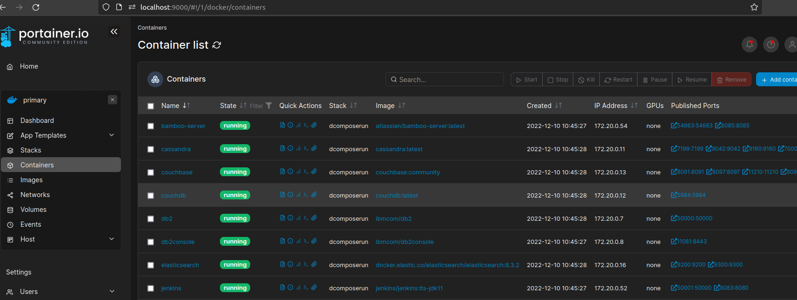

# dcomposerun


## About This Project

Simple Docker Orchestration for Development Tools, DevOps, Security and others. This tool using docker-compose to manage multi docker container.<br/>
Purpose of this project is to accelarate preparation of sharing resource server (commonly for development/sandbox and staging server). <br/>
<br/>

## Container List

### Development Tools
| No    | Tools                 | Purpose   | Website   | Port Mapping  |
| --    | -----                 | -------   | -------   | ------------  |
| 1     | Portainer CE          | GUI multi container management platform | https://www.portainer.io/ | 9000 |
| 2     | MySQL 5.7             | Open source RDBMS | https://www.mysql.com/ | 3306 |
| 3     | MySQL Workbench       | Unified visual tool for database | https://www.mysql.com/products/workbench/ | 3000 |
| 4     | PostgreSQL 15         | Open source RDBMS | https://www.postgresql.org/ | 5432 |
| 5     | PgAdmin4              | GUI Database Administration for PostgreSQL | https://www.pgadmin.org | 5050 |
| 6     | IBM Db2               | Data managment products developed by IBM | https://www.ibm.com/id-en/products/db2 | 50000 |
| 7     | IBM Db2 Console       | Browser-based console to administer, monitor and manage IBM Db2 | https://www.ibm.com/id-en/products/db2-data-management-console | 11081 |
| 8     | MongoDB               | Document oriented database program | https://www.mongodb.com/ | 27017 |
| 9     | Mongo-Express         | Web-based MongoDB admin interface | https://github.com/mongo-express/mongo-express | 8081 |
| 10    | Cassandra             | Open source NoSQL distributed database system | https://cassandra.apache.org/ | 7000, 7001, 7199, 9042, 9160 |
| 11    | CouchDB               | Open source document oriented NoSQL database | https://couchdb.apache.org/ | 5984 |
| 12    | Couchbase             | Distributed NoSQL cloud database | https://www.couchbase.com/ | 8091-8097, 11210-11211 |
| 13    | Redis                 | In-memory data structure store | https://redis.io/ | 6379 |
| 14    | Redis-Commander       | Redis web-based management tool | https://www.npmjs.com/package/redis-commander | 8082 |
| 15    | Elasticsearch         | Search engine and analytic solution based on Lucene library | https://www.elastic.co/ | 9200, 9300 |
| 16    | Kibana                | Data visualization dashboard for Elasticsearch | https://www.elastic.co/kibana/ | 5601 |
| 17    | RabbitMQ              | Open source message-broker that implemented AMQP | https://www.rabbitmq.com/ | 5672, 15672 |
| 18    | Keycloak              | Open source SSO software with Identity and Access Management | https://www.keycloak.org/ | 8084:8080 |

### DevOps Tools
| No    | Tools                 | Purpose   | Website   | Port Mapping  |
| --    | -----                 | -------   | -------   | ------------  |
| 1     | Nginx                 | Web Server that can be used for reverse proxy, load balancer, HTTP cache, media streaming | https://www.nginx.com/ | 8080, 443 |
| 2     | Jenkins Controller    | Node for Jenkins Server (an automated server which related to build, test, and deploy code) | https://www.jenkins.io/ | 8083:8080, 50001:50000 |
| 3     | Jenkins Agent         | Node to run build tasks that are scheduled by the Jenkins Controller | https://www.jenkins.io/ | 22 |
| 4     | Atlassian Bamboo      | CI/CD tool, used for automated build, test, and deploy | https://www.atlassian.com/software/bamboo | 8085:8085 |

### Security Tools
| No    | Tools                   | Purpose   | Website   | Port Mapping  |
| --    | -----                   | -------   | -------   | ------------  |
| 1     | Zed Attack Proxy (ZAP)  | Open source web application security scanner | https://www.zaproxy.org/ | 8180:8080, 8190:8090 |
<br />

## Prerequisites

These are software that needs to be installed before use:
1. Docker <br/>
    Read documentation to install docker [https://docs.docker.com/engine/install/](https://docs.docker.com/engine/install/) <br/>
    After installation complete, check docker engine version to make sure docker install successfully
    ```sh
    docker --version
    ```
2. Docker Compose<br/>
    Read documentation to install docker compose [https://docker-docs.netlify.app/compose/install/](https://docker-docs.netlify.app/compose/install/) <br/>
    After installation complete, check docker compose version to make sure docker compose install successfully
    ```sh
    docker-compose version
    ```
<br/>

## How To Use

* Command to download docker images and start services (in background) based on compose file definition
  ```sh
  docker-compose up -d
  ```
* Command to stop all services
  ```sh
  docker-compose down
  ```
* Command for update docker images
  ```sh
  docker-compose pull
  ```
* Add your user for non-root user to docker group
  ```sh
  sudo usermod -aG docker $user
  ```
* Check all containers are running
  ```sh
  docker ps -a
  ```
  We can check and manage these containers on portainer<br />
  <div align="left">
    
  </div>

<br />

## Please Attention

_Below are list that needs to be awared before running this service._

1. Change credential setting on compose file, such as user and password, especially when you used for public server (Don't use default configuration on Production Server).
Credential on this project just for sample configuration.
2. Please remove or change as comment for unused service.
If run this service (`docker-compose up -d`) with default configuration, it will download all related docker images, and then running all services simultaneously. This will cause an issue for entry level PC


<!-- MARKDOWN LINKS & IMAGES -->
